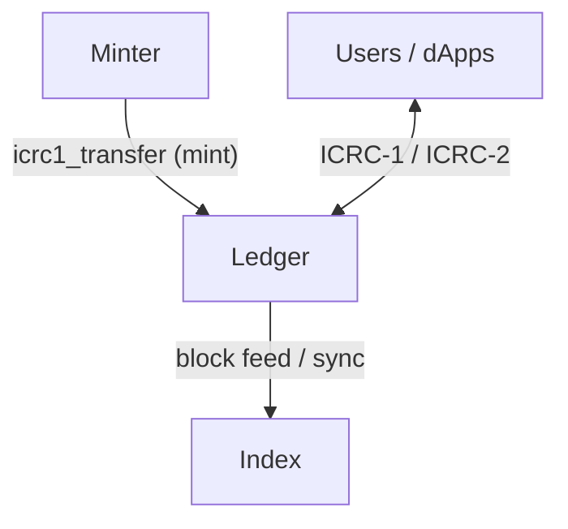

# VICI ICRC

VICI is a fungible token on the [Internet Computer](https://internetcomputer.org/) built on top of the **ICRC** family of standards. This repository contains the full on-chain infrastructure: ledger, index, and minter canisters.

## Standards implemented

| Standard                                                                         | What it defines                                                            | Specification       |
| -------------------------------------------------------------------------------- | -------------------------------------------------------------------------- | ------------------- |
| [ICRC-1](https://github.com/dfinity/ICRC-1/blob/main/standards/ICRC-1/README.md) | Fungible token interface -- transfers, balances, metadata, minting account | Core token standard |
| [ICRC-2](https://github.com/dfinity/ICRC-1/blob/main/standards/ICRC-2/README.md) | Approve & transfer-from (allowance model)                                  | Extends ICRC-1      |
| [ICRC-3](https://github.com/dfinity/ICRC-1/blob/main/standards/ICRC-3/README.md) | Transaction log (block archive)                                            | On-chain history    |

The ledger and index canisters are the official DFINITY implementations from the [IC repository](https://github.com/dfinity/ic), deployed as pre-built WASM modules.

## Architecture

```
                          ┌────────────┐
                          │   Minter   │
                          │  (Rust)    │
                          └─────┬──────┘
                                │ icrc1_transfer (mint)
                                │ icrc1_balance_of
                                ▼
┌──────────┐           ┌────────────────┐
│  Users / │  ICRC-1   │                │
│  dApps   │◄─────────►│     Ledger     │
│          │  ICRC-2   │                │
└──────────┘           └───────┬────────┘
                               │ block feed
                               ▼
                        ┌──────────────┐
                        │              │
                        │    Index     │
                        │              │
                        └──────────────┘
```

**Diagram choice:** use a **flowchart** (or the ASCII above) for static topology—what depends on what. Use a **sequence diagram** when you want the **order of calls** for one concrete flow (for example minting into a reserve). Neither is “wrong”; they answer different questions.

### Mermaid — topology



### Mermaid — mint to reserve (illustrative sequence)

Only the minter may create new tokens; it does so by transferring from the ledger’s minting account to a configured reserve.

```mermaid
sequenceDiagram
  participant M as Minter
  participant L as Ledger
  participant R as Reserve account

  M->>L: icrc1_transfer (minting account → reserve)
  L-->>M: Ok / err (new block)
  Note over L,R: Reserve balance increases; rules in minter README apply.
```

### Ledger

The **ledger canister** is the source of truth for VICI token balances and transactions. It implements ICRC-1, ICRC-2, and ICRC-3.

Key properties:

- Maintains an append-only transaction log.
- Every transfer, mint, burn, and approval is recorded as a block.
- Has a designated **minting account** (the minter canister's principal). Only transfers from this account create new tokens.
- Exposes standard `icrc1_transfer`, `icrc1_balance_of`, `icrc2_approve`, `icrc2_transfer_from`, and metadata methods.
- Deployed from the official DFINITY WASM release; no custom code.

### Index

The **index canister** continuously syncs blocks from the ledger and provides efficient lookup capabilities that the ledger itself does not offer:

- List transactions for a given account.
- Query an account's balance (redundantly, for faster reads).
- Track all accounts that have ever interacted with the token.

It is deployed from the official DFINITY `icrc1-index-ng` WASM release and depends solely on the ledger canister.

### Minter

The **minter canister** is a custom Rust canister that acts as the ledger's minting account. It manages a set of _reserve accounts_ -- trusted system accounts whose VICI balance the minter keeps topped up via configurable rebalancing rules.

The minter never mints tokens to arbitrary users. All minting flows through the reserve system with multiple layers of safety controls: global policy flags, per-reserve balance targets, lifetime minimum/maximum guarantees, per-operation caps, and sliding-window rate limits.

A recurring **auto-rebalance timer** (1-hour interval) runs inside the canister, automatically refilling reserves when their balance drops below the configured target. This makes the minter self-operating — no external cron or scheduler required.

See the [minter README](src/minter/README.md) for a detailed description of its logic, API, and configuration.

## Tokenomics

The token distribution model, supply schedule, and reserve allocation strategy are described in the [Tokenomics](TOKENOMICS.md) document.

## Project structure

```
vici-points/
  dfx.json                   Canister declarations (minter, ledger, index)
  Cargo.toml                 Rust workspace root
  TOKENOMICS.md              Token economics and reserve-aligned supply policy
  src/
    minter/                  Minter canister (Rust)
      Cargo.toml
      minter.did             Auto-generated Candid interface
      README.md              Minter documentation
      src/                   Source code
  scripts/
    build.ledger.args.sh              Generates ledger init/upgrade arguments
    build.index.args.sh               Generates index init arguments
    init.reserves.sh                  Register minter reserves (10 reserves, per-bucket caps)
    init.reserves.config.example.sh   Copy to init.reserves.config.sh (10 principals, gitignored)
    did.sh                            Regenerates .did files from compiled WASM
    format.sh                         Code formatting
    lint.sh                           Linting
```

## Development

### Prerequisites

- [dfx](https://internetcomputer.org/docs/building-apps/getting-started/install) (Internet Computer SDK)
- [Rust](https://rustup.rs/) with the `wasm32-unknown-unknown` target
- [candid-extractor](https://crates.io/crates/candid-extractor) (for `.did` generation)

### Local deployment

```bash
dfx start --background
dfx deploy
```

### Regenerate Candid interface

```bash
bash scripts/did.sh
```

### Lint and format

```bash
bash scripts/lint.sh
bash scripts/format.sh
```

## Links

- [ICRC-1 Standard](https://github.com/dfinity/ICRC-1/blob/main/standards/ICRC-1/README.md)
- [ICRC-2 Standard](https://github.com/dfinity/ICRC-1/blob/main/standards/ICRC-2/README.md)
- [ICRC-3 Standard](https://github.com/dfinity/ICRC-1/blob/main/standards/ICRC-3/README.md)
- [DFINITY Ledger Suite Releases](https://github.com/dfinity/ic/releases)
- [Internet Computer Documentation](https://internetcomputer.org/docs)
